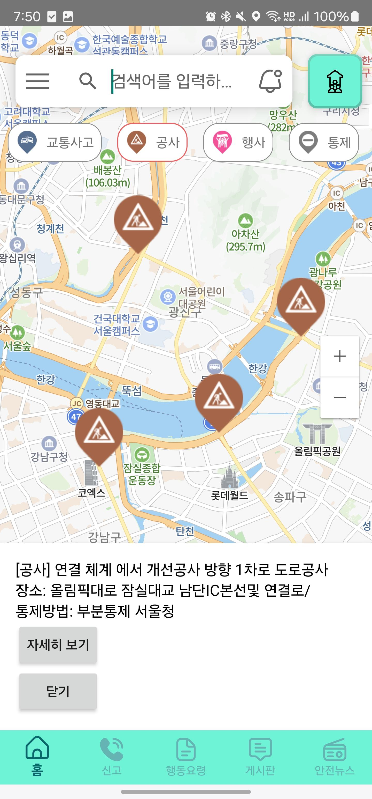
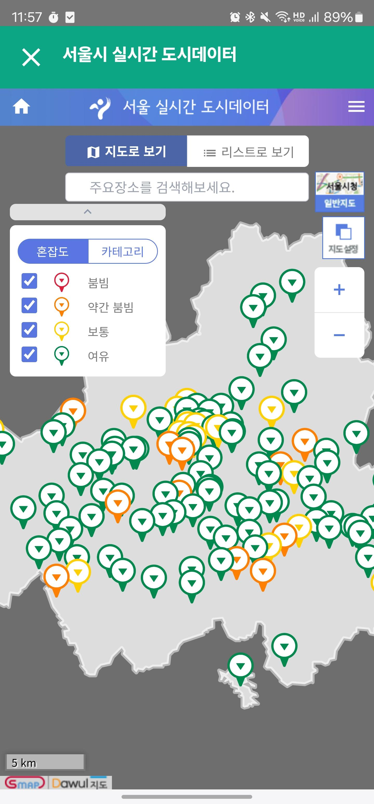
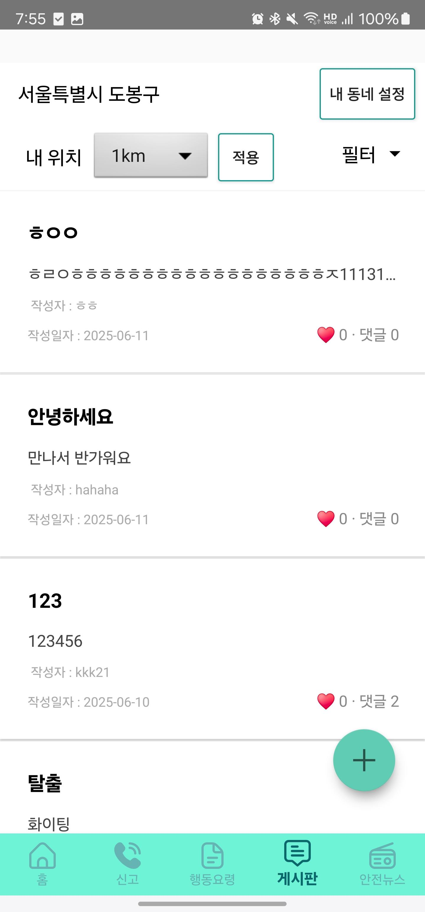
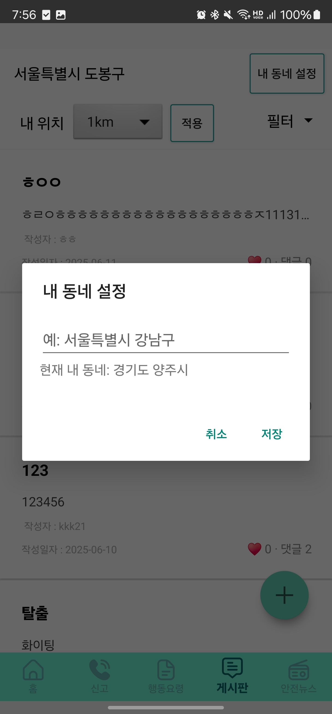
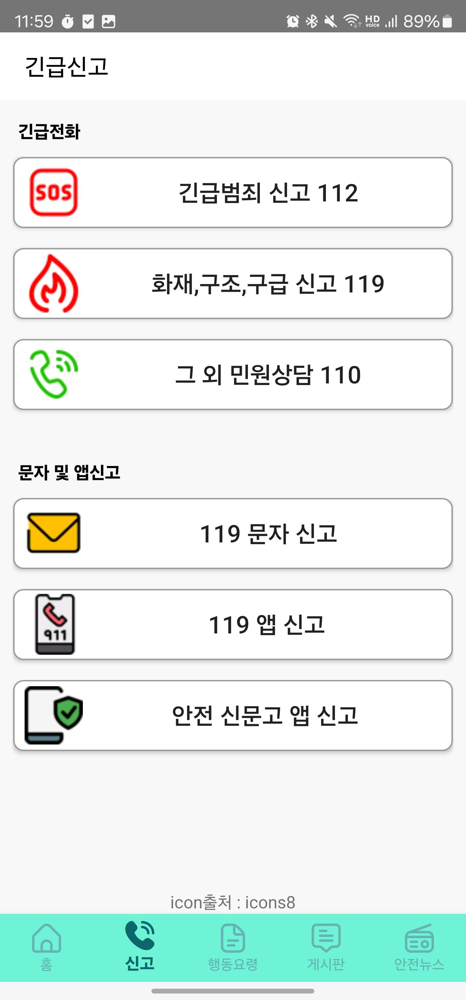
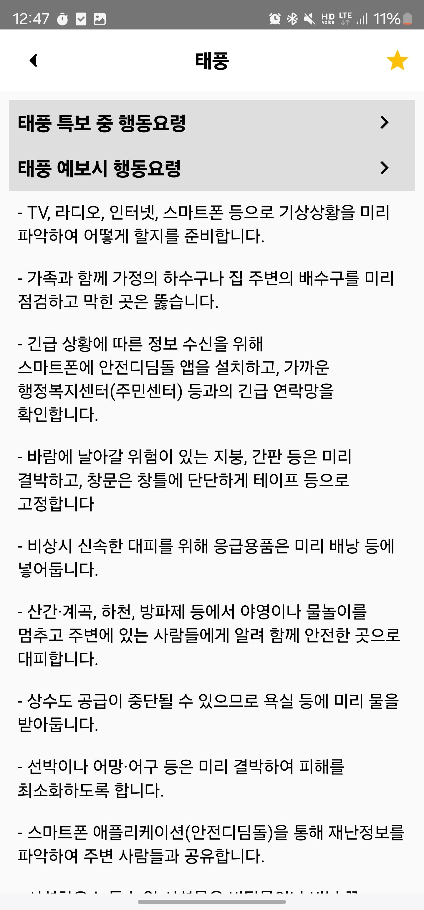
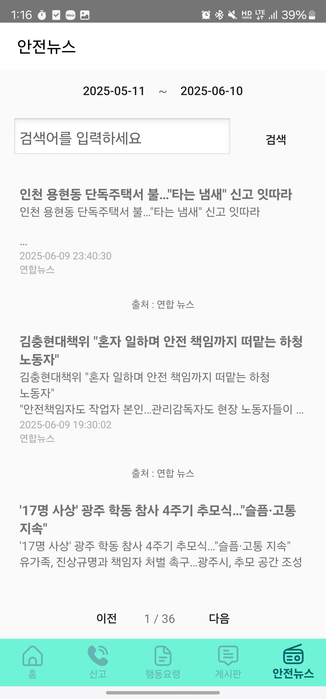
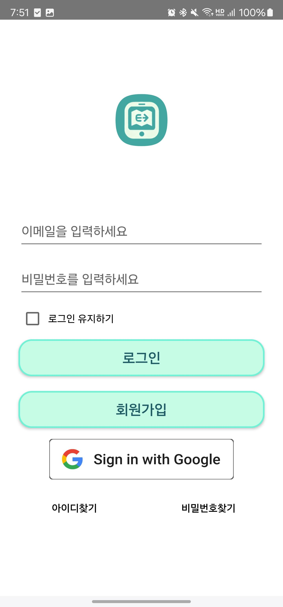
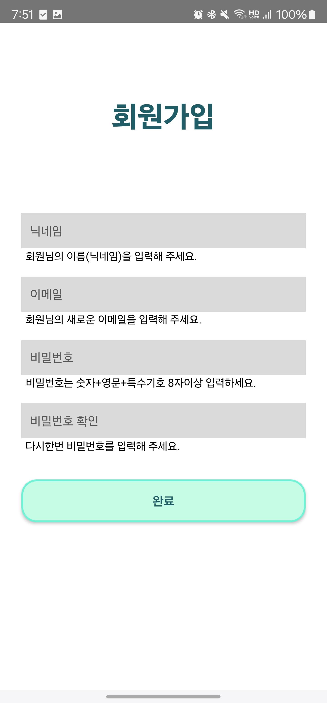

# 🚨 안심이음

> **안전을 나누고, 안심을 잇다**

지역 기반의 안전 정보를 제공하고 사용자가 주변의 위험 요소와 안전시설을 확인할 수 있도록 제작한 **Android 기반 지역 안전 애플리케이션**입니다.

여러 공공 안전 데이터를 지도에 통합하고, 사용자의 현재 위치를 기준으로 주변의 위험 요소와 안전시설을 확인할 수 있도록 구현했습니다.

---

## 📌 프로젝트 개요

| 항목       | 내용                |
| -------- | ----------------- |
| 프로젝트명    | 안심이음              |
| 프로젝트 기간  | 2026.07 ~ 2026.08 |
| 프로젝트 유형  | 개인 프로젝트           |
| 플랫폼      | Android           |
| 주요 언어    | Kotlin            |
| 지도       | Naver Maps SDK    |
| 주요 개발 환경 | Android Studio    |

---

## 🎯 프로젝트 소개

기존 안전 관련 서비스는 특정 종류의 안전 정보에 집중되어 있어 사용자가 자신의 주변에서 발생하는 다양한 위험 요소와 안전시설 정보를 한눈에 확인하기 어려운 문제가 있었습니다.

**안심이음**은 이러한 문제를 해결하기 위해 여러 공공 안전 데이터를 하나의 지도에서 확인할 수 있도록 구성한 지역 기반 안전 애플리케이션입니다.

사용자의 현재 위치를 기반으로 주변의 위험 정보와 안전시설을 확인할 수 있으며, 재난 및 안전사고와 관련된 정보도 함께 제공하도록 구현했습니다.

### 핵심 목표

* 주변 위험 요소를 지도에서 직관적으로 확인
* AED, 병원, 경찰서, 소방서 등 안전시설 위치 제공
* 다양한 공공 API 데이터를 하나의 애플리케이션에서 통합
* 위치 기반 안전 정보 제공
* 재난 및 안전 관련 정보 제공
* 사용자가 지역의 안전 정보를 쉽게 확인할 수 있는 환경 구축

---

# ✨ 주요 기능

## 1. 🗺️ 지도 기반 안전 정보

Naver Maps SDK를 활용하여 사용자의 현재 위치와 주변 안전 정보를 지도에 표시했습니다.

### 주요 기능

* 현재 위치 표시
* 주변 위험 요소 마커 표시
* 안전시설 마커 표시
* 위험 정보 필터링
* 안전시설 필터링
* 위치 기반 안전 정보 조회

### 위험 정보

* 교통사고
* 공사
* 행사
* 통제
* 산불
* 산사태
* 지진
* 대형화재
* 대형 건축물 붕괴
* 지하철 대형사고
* 댐 붕괴
* 기타 재난 및 위험 정보

### 안전 정보

* 스쿨존 사고다발지역
* AED(자동심장충격기)
* 소방서
* 경찰서
* 종합병원
* 지진 옥외대피소



---

## 2. 🚑 안전시설 정보

공공데이터 API를 활용하여 사용자의 주변에 위치한 안전시설 정보를 조회하고 지도에 표시했습니다.

### 제공 정보

* 자동심장충격기(AED)
* 병원
* 경찰서
* 소방서
* 지진 옥외대피소
* 스쿨존 사고다발지역



---

## 3. 📢 지역 안전 게시판

사용자가 주변에서 발생한 사건·사고 및 안전 관련 정보를 확인하고 공유할 수 있도록 지역 기반 게시판 기능을 구성했습니다.





---

## 4. 🚨 긴급 신고

긴급 상황에서 필요한 신고 기능을 사용할 수 있도록 구성했습니다.



---

## 5. 📖 국민행동요령

재난 및 안전사고 발생 시 상황별 행동요령을 확인할 수 있도록 구성했습니다.



---

## 6. 📰 재난·안전 뉴스

재난 및 안전과 관련된 최신 정보를 확인할 수 있도록 뉴스 기능을 구현했습니다.



---

## 7. 👤 회원가입 / 로그인

이메일과 비밀번호를 이용한 회원가입 및 로그인과 Google 로그인을 지원합니다.





---

# 👨‍💻 주요 담당 업무

## 1. Naver Maps SDK 연동

Android 애플리케이션에 Naver Maps SDK를 적용하여 위치 기반 안전 정보 서비스를 구현했습니다.

### 구현 내용

* Naver Maps SDK 연동
* 사용자 현재 위치 표시
* 지도 초기 위치 설정
* 안전시설 마커 표시
* 위험 정보 마커 표시
* 마커 클릭을 통한 정보 확인
* 안전/위험 정보 필터 기능 구현
* 위치 기반 데이터 표시

지도 화면을 애플리케이션의 핵심 화면으로 구성하여 다양한 공공 데이터를 지도에서 직관적으로 확인할 수 있도록 구현했습니다.

---

## 2. 공공 API 연동

여러 기관에서 제공하는 공공데이터 API를 Android 애플리케이션과 연동했습니다.

### 주요 연동 데이터

* 경찰청 관련 안전 데이터
* AED 데이터
* 병원 데이터
* 소방서 데이터
* 경찰서 데이터
* 교통사고 데이터
* 인구 밀집도 데이터
* 재난·안전 뉴스 데이터
* 스쿨존 사고다발지역 데이터

서로 다른 API에서 제공되는 데이터를 애플리케이션에서 활용할 수 있도록 요청 및 응답 데이터를 처리하고 필요한 형태로 변환했습니다.

---

## 3. API 통신 및 데이터 처리

Android에서 외부 API를 호출하고 응답 데이터를 처리하는 기능을 구현했습니다.

### 사용 기술

* Retrofit
* Volley
* OkHttp
* Gson
* XML Parser
* JSON 데이터 처리

공공 API 중 XML 형식으로 제공되는 데이터는 XML Parser를 활용하여 필요한 정보를 추출했으며, JSON 형식의 데이터는 Gson 등을 활용하여 애플리케이션에서 사용할 수 있는 객체 형태로 변환했습니다.

---

## 4. GCP 기반 Proxy Server 구축

경찰청 API를 연동하는 과정에서 **고정 IP를 요구하는 API 호출 환경**을 구성해야 하는 문제가 발생했습니다.

Android 애플리케이션에서 API를 직접 호출할 경우 개발 환경이나 디바이스에 따라 IP가 달라질 수 있기 때문에 GCP를 이용한 Proxy Server를 구축했습니다.

### 구성

```text
Android Application
        │
        │ API Request
        ▼
GCP Proxy Server
        │
        │ Fixed IP
        ▼
경찰청 API
```

### 사용 기술

* Google Cloud Platform
* Node.js
* Express
* Proxy Server

Android 애플리케이션의 요청을 GCP 서버가 전달하고, 서버에서 공공 API의 응답을 받아 다시 Android 애플리케이션으로 전달하는 방식으로 구성했습니다.

---

# 🔥 주요 트러블슈팅

## 1. 경찰청 API 고정 IP 문제

### 문제

경찰청 API를 Android 애플리케이션에서 직접 호출하는 과정에서 고정 IP 환경이 필요한 문제가 발생했습니다.

개발 환경과 테스트 디바이스가 변경될 경우 API 요청이 정상적으로 처리되지 않을 가능성이 있었습니다.

### 해결

Google Cloud Platform을 활용하여 Proxy Server를 구축했습니다.

Android 애플리케이션에서 경찰청 API를 직접 호출하지 않고 GCP 서버를 거쳐 요청하도록 구성하여 고정 IP 환경에서 API를 호출할 수 있도록 해결했습니다.

```text
[Android]

API Request
     │
     ▼
[GCP Proxy Server]

API Request
     │
     ▼
[경찰청 API]

Response
     │
     ▼
[GCP Proxy Server]

Response
     │
     ▼
[Android]
```

---

## 2. 공공 API 데이터 형식 차이

### 문제

연동하는 공공 API마다 응답 형식과 데이터 구조가 서로 달랐습니다.

특히 XML 기반 API와 JSON 기반 API가 혼재되어 있어 동일한 방식으로 데이터를 처리하기 어려웠습니다.

### 해결

API별 응답 형식에 맞춰 데이터 처리 방식을 분리했습니다.

* JSON → Gson 등을 이용한 객체 변환
* XML → XML Parser를 이용한 데이터 추출
* 문자열 인코딩 문제에 대응
* 필요한 데이터만 추출하여 Android 화면에 표시

이를 통해 서로 다른 기관에서 제공하는 데이터를 하나의 Android 애플리케이션에서 통합하여 사용할 수 있도록 구성했습니다.

---

# 🛠️ 기술 스택

## Android

* Kotlin
* Android Studio
* Android SDK
* Naver Maps SDK
* ViewBinding
* DataBinding
* RecyclerView
* WorkManager

## 네트워크 / API

* Retrofit
* Volley
* OkHttp
* Gson
* Jsoup

## 지도 / 위치

* Naver Maps SDK
* Android Location API

## 공공데이터

* 경찰청 관련 공공 API
* AED API
* 국립중앙의료원 병원 API
* 소방서 / 경찰서 관련 데이터
* 경기데이터드림
* 교통사고 데이터
* 인구 밀집도 데이터
* 재난·안전 뉴스 데이터

## Server

* Google Cloud Platform
* Node.js
* Express
* Proxy Server

---

# 🏗️ 시스템 구성

```text
┌─────────────────────────────┐
│       Android Application   │
│           Kotlin            │
└──────────────┬──────────────┘
               │
       ┌───────┼────────────┐
       │       │            │
       ▼       ▼            ▼
  Naver Map  Firebase   GCP Proxy
                           │
                           ▼
                      Public APIs
```

Android 애플리케이션에서 위치 및 지도 정보를 처리하고, 외부 공공 API에서 필요한 안전 데이터를 가져와 사용자에게 제공합니다.

일부 API는 직접 호출이 어려운 환경적 제약이 있어 GCP Proxy Server를 통해 요청을 전달하도록 구성했습니다.

---

# 📱 주요 화면

| 화면     | 주요 기능                 |
| ------ | --------------------- |
| 로그인    | 이메일/비밀번호 및 Google 로그인 |
| 회원가입   | 사용자 계정 생성             |
| 메인 지도  | 현재 위치 및 안전·위험 정보 표시   |
| 위험 필터  | 재난·사고 등 위험 정보 선택      |
| 안전 필터  | AED·병원·경찰서·소방서 등 선택   |
| 게시판    | 지역 안전 정보 공유           |
| 긴급 신고  | 긴급 상황 신고              |
| 국민행동요령 | 재난 상황별 행동요령           |
| 안전뉴스   | 재난·안전 관련 뉴스           |
| 인구 밀집도 | 지역별 인구 밀집 정보 확인       |
| 재난 정보  | 지진·태풍 등 재난 정보 확인      |

---

# 📂 프로젝트 구조

```text
ansim-ieum/
│
├── app/
│   ├── src/
│   │   └── main/
│   │       ├── java/
│   │       │   └── com/example/myapplication/
│   │       │       ├── MainActivity.kt
│   │       │       ├── MapActivity.kt
│   │       │       ├── MapFragment.kt
│   │       │       ├── BaseMapFragment.kt
│   │       │       ├── ApiService.kt
│   │       │       ├── AEDMapHelper.kt
│   │       │       ├── EmergencyAlertWorker.kt
│   │       │       ├── PopulationActivity.kt
│   │       │       ├── EarthquakeActivity.kt
│   │       │       ├── TyphoonActivity.kt
│   │       │       ├── BoardActivity.kt
│   │       │       ├── SocialActivity.kt
│   │       │       └── ...
│   │       │
│   │       ├── res/
│   │       └── AndroidManifest.xml
│   │
│   └── build.gradle.kts
│
├── gradle/
├── build.gradle.kts
├── settings.gradle.kts
├── gradle.properties
└── gradlew
```

---

# 🚀 실행 방법

현재 프로젝트는 외부 API Key, Firebase 설정 및 GCP Proxy Server 등의 외부 환경에 의존합니다.

또한 현재 **GCP Proxy Server가 종료된 상태**이므로 저장소를 Clone한 후 별도의 환경 설정 없이 모든 기능을 바로 실행할 수 있는 상태는 아닙니다.

```bash
git clone https://github.com/shw1717/ansim-ieum.git
```

Android Studio에서 프로젝트를 열고 Gradle Sync를 진행한 후 Android Emulator 또는 실제 Android 디바이스에서 실행할 수 있습니다.

### 필요한 외부 환경

* Naver Maps API Key
* 공공 API Key
* Firebase 설정
* Google 로그인 설정
* GCP Proxy Server 환경

> API Key 및 인증 정보와 같은 민감한 정보는 저장소에 직접 포함하지 않는 것을 권장합니다.

---

# 📚 프로젝트를 통해 배운 점

### Android 애플리케이션 개발

Kotlin과 Android Studio를 활용하여 실제 서비스 형태의 Android 애플리케이션을 개발하면서 Activity, Fragment, RecyclerView, ViewBinding 등의 Android 개발 구조를 경험했습니다.

### 지도 기반 서비스 구현

Naver Maps SDK를 활용하여 현재 위치를 표시하고 다양한 안전 데이터를 지도 마커로 표현하는 위치 기반 서비스를 구현했습니다.

### 공공 API 활용

서로 다른 기관에서 제공하는 공공데이터 API를 분석하고 애플리케이션에 필요한 형태로 가공하여 통합하는 경험을 했습니다.

### 서버 구축

API의 고정 IP 문제를 해결하기 위해 GCP 기반 Proxy Server를 구축하면서 Android 애플리케이션과 서버 간의 데이터 통신 구조를 경험했습니다.

### 문제 해결 경험

API 응답 형식 차이, XML 데이터 처리, 인코딩 문제, API 호출 제한 등의 문제를 직접 해결하면서 실제 개발 과정에서 발생하는 문제를 분석하고 해결하는 경험을 쌓았습니다.

---

# 🔧 향후 개선 방향

* UI/UX 개선
* 공공 안전 API 추가 연동
* 실시간 안전 정보 제공
* 사용자 참여형 안전 지도 구축
* 서버 운영 환경 개선
* API 응답 속도 및 안정성 개선
* 안전 데이터 시각화 강화

---

# 📌 개인 작업 요약

### 내가 구현 및 담당한 주요 영역

* Android 애플리케이션 개발
* Kotlin 기반 기능 구현
* Naver Maps SDK 연동
* 현재 위치 기반 지도 기능
* 안전/위험 마커 표시
* 안전/위험 정보 필터 기능
* 공공 안전 API 연동
* API 응답 데이터 처리
* XML / JSON 데이터 파싱
* 경찰청 API 연동
* AED API 연동
* 병원 API 연동
* 소방서 / 경찰서 데이터 연동
* 교통사고 데이터 연동
* 인구 밀집도 데이터 연동
* 재난·안전 뉴스 데이터 연동
* GCP 기반 Proxy Server 구축
* Node.js + Express 기반 API 중계 환경 구성
* API 연동 과정에서 발생한 문제 해결

---

## 📄 Project Presentation

졸업작품 발표자료에는 프로젝트의 기획 배경, 주요 기능, 시스템 구성 및 구현 과정이 포함되어 있습니다.
