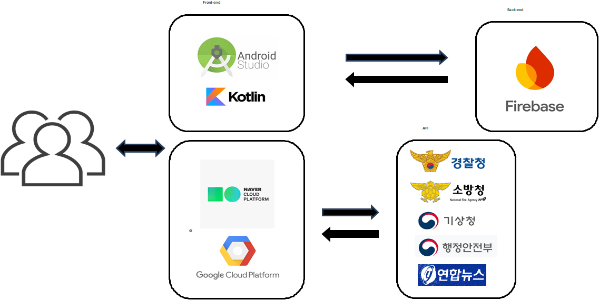

# 🚨 안심이음

> **안전을 나누고, 안심을 잇다**

지역 기반의 안전 정보를 제공하고 사용자가 주변의 위험 요소를 확인하며 안전 정보를 공유할 수 있도록 제작한 **Android 기반 지역 안전 커뮤니티 애플리케이션**입니다.

여러 공공 안전 데이터를 지도에 통합하고, 사용자의 현재 위치를 기준으로 주변의 위험 요소와 안전시설을 확인할 수 있도록 구현했습니다.

---

## 📌 프로젝트 개요

| 항목 | 내용 |
|---|---|
| 프로젝트명 | 안심이음 |
| 프로젝트 기간 | 2024.09 ~ 2025.11 |
| 프로젝트 유형 | 대학 졸업작품 |
| 플랫폼 | Android |
| 개발 인원 | 3명 |
| 주요 언어 | Kotlin |
| 지도 | Naver Maps SDK |
| 서버 | Google Cloud Platform(GCP) |
| 저장소 | [GitHub](https://github.com/shw1717/android-studio) |

### 👥 팀 구성

| 이름 | 역할 |
|---|---|
| 강지훈 | 팀장 / 프로젝트 총괄 / 데이터베이스 |
| **송현우** | **Back-end / 공공 API 연동 / 간이 서버 구축** |
| 한지현 | Front-end / API 연동 |

---

## 🎯 프로젝트 소개

기존 안전 서비스는 특정 종류의 안전 정보에 집중되어 있어 사용자가 자신의 주변에서 발생하는 다양한 위험 요소와 안전시설 정보를 한눈에 확인하기 어려운 점이 있었습니다.

**안심이음**은 여러 공공 안전 데이터를 하나의 지도에서 제공하고, 지역 주민이 안전 관련 정보를 공유할 수 있도록 제작한 지역 중심의 안전 커뮤니티 애플리케이션입니다.

### 핵심 목표

- 주변의 위험 요소를 지도에서 직관적으로 확인
- AED, 병원, 경찰서, 소방서 등 안전시설 위치 제공
- 공공 API를 활용한 다양한 안전 데이터 통합
- 지역 기반 안전 정보 공유
- 재난·안전 관련 정보와 행동요령 제공

---

## ✨ 주요 기능

### 1. 🗺️ 지도 기반 안전 정보

Naver Maps SDK를 활용하여 사용자의 현재 위치와 주변 안전 정보를 지도에 표시합니다.

- 현재 위치 표시
- 위험 요소 마커 표시
- 안전시설 마커 표시
- 위험/안전 정보 필터링

#### 위험 정보

- 교통사고
- 공사
- 행사
- 통제
- 산불
- 산사태
- 지진
- 대형화재
- 대형 건축물 붕괴
- 지하철 대형사고
- 댐 붕괴
- 기타 재난·위험 정보

#### 안전 정보

- 스쿨존 사고다발지역
- AED(자동심장충격기)
- 소방서
- 경찰서
- 종합병원
- 지진 옥외대피소


---

### 2. 🚑 안전시설 정보

공공 API를 활용하여 사용자의 주변에 위치한 안전시설 정보를 제공합니다.

- 자동심장충격기(AED)
- 병원
- 경찰서
- 소방서
- 지진 옥외대피소
- 스쿨존 사고다발지역


---

### 3. 📢 지역 안전 게시판

지역 주민이 주변에서 발생한 사건·사고 및 안전 관련 정보를 공유할 수 있는 커뮤니티 기능입니다.


---

### 4. 🚨 긴급 신고

긴급 상황에서 신고 기능을 이용할 수 있도록 구성했습니다.


---

### 5. 📖 국민행동요령

재난 및 안전사고 발생 시 상황별 행동요령을 확인할 수 있습니다.


---

### 6. 📰 재난 안전 뉴스

재난 및 안전 관련 뉴스를 확인할 수 있도록 구성했습니다.


---

### 7. 👤 회원가입 / 로그인

이메일/비밀번호 및 Google 로그인을 지원합니다.


> Firebase 인증 관련 기능은 팀원이 담당했습니다.

---

## 🛠️ 기술 스택

### Android

- Kotlin
- Android Studio
- Android SDK
- Naver Maps SDK

### API / 데이터

- Naver Maps API
- 경찰청 관련 공공 API
- 경기데이터드림
- 국립중앙의료원
- AED 관련 API
- 교통사고 관련 API
- 인구 밀집도 관련 API
- 재난·안전 뉴스 관련 API

### Backend / Server

- Google Cloud Platform(GCP)
- Node.js
- Express
- Proxy Server

### Database / Authentication

- Firebase Authentication
- Firebase Firestore

> Firebase 및 게시판 데이터 처리의 일부는 팀원이 담당했습니다.

---

## 🏗️ 시스템 구성



```text
┌─────────────────────────────┐
│       Android Application   │
│           Kotlin            │
└──────────────┬──────────────┘
               │
       ┌───────┼────────┐
       │       │        │
       ▼       ▼        ▼
   Naver Map  Firebase  GCP Proxy
                         │
                         ▼
                    공공 API
```

---

# 👨‍💻 담당 업무

## 송현우

### 1. Naver Map SDK 연동

- Naver Maps SDK를 Android 애플리케이션에 적용
- 사용자의 현재 위치 표시
- 안전 및 위험 정보를 지도 마커로 표시
- 위험/안전 정보 필터 기능 구현

### 2. 공공 API 연동

안전 관련 공공 데이터를 Android 애플리케이션에서 활용할 수 있도록 API를 연동했습니다.

주요 연동 데이터:

- 경찰청 관련 데이터
- AED 데이터
- 병원 데이터
- 소방서 데이터
- 경찰서 데이터
- 교통사고 데이터
- 인구 밀집도 데이터
- 재난·안전 뉴스

### 3. GCP 기반 간이 서버 구축

경찰청 API 연동 과정에서 고정 IP를 요구하는 문제가 발생했습니다.

개발 환경에서 여러 디바이스가 API를 직접 호출할 경우 IP 제한으로 요청이 차단될 수 있었기 때문에, GCP를 활용하여 Proxy Server를 구축하고 API 요청을 중계하도록 구성했습니다.

```text
Android App
     │
     │ API Request
     ▼
GCP Proxy Server
     │
     │ Fixed IP
     ▼
경찰청 API
```

발표자료 기준으로 Proxy Server는 **Node.js + Express**를 사용하여 구현했습니다.

---

# 🔥 주요 트러블슈팅

## 1. 경찰청 API 고정 IP 제한

### 문제

경찰청 API가 고정 IP 환경을 요구하여 개발 중인 다양한 디바이스에서 API 호출이 차단되는 문제가 발생했습니다.

### 해결

Google Cloud Platform을 활용하여 고정 IP 기반 Proxy Server를 구축했습니다.

Android 애플리케이션이 경찰청 API를 직접 호출하는 대신 GCP 서버를 거쳐 요청하도록 구성하여 IP 제한 문제를 해결했습니다.

---

# 📱 주요 화면

| 화면 | 설명 |
|---|---|
| 로그인 | 이메일/비밀번호 및 Google 로그인 |
| 회원가입 | 신규 사용자 계정 생성 |
| 메인 지도 | 현재 위치 및 안전·위험 정보 표시 |
| 위험 필터 | 재난·사고 등 위험 정보 선택 |
| 안전 필터 | AED·병원·경찰서·소방서 등 선택 |
| 내 정보 | 사용자 관련 정보 |
| 긴급 신고 | 긴급 상황 신고 |
| 국민행동요령 | 재난 상황별 행동요령 |
| 게시판 | 지역 안전 정보 공유 |
| 안전뉴스 | 재난·안전 관련 뉴스 |

---

# 📂 프로젝트 구조

```text
android-studio/
│
├── app/
│   ├── src/
│   │   └── main/
│   │       ├── java/
│   │       ├── res/
│   │       └── AndroidManifest.xml
│   │
│   └── build.gradle.kts
│
├── gradle/
├── build.gradle.kts
├── settings.gradle.kts
├── gradle.properties
└── gradlew
```

---

# 🚀 실행 방법

현재 프로젝트는 외부 API Key, Firebase 설정 및 GCP Proxy Server 등의 외부 환경에 의존합니다.

또한 현재는 **GCP Proxy Server가 종료된 상태**이므로 저장소를 Clone한 후 별도의 환경 설정 없이 모든 기능을 바로 실행할 수 있는 상태는 아닙니다.

```bash
git clone https://github.com/shw1717/android-studio.git
```

Android Studio에서 프로젝트를 열고 Gradle Sync 후 Android Emulator 또는 실제 Android 디바이스에서 실행합니다.

### 필요한 외부 설정

- Naver Maps API Key
- 공공 API Key
- Firebase 설정
- Google 로그인 설정
- GCP Proxy Server 환경

> API Key 및 인증 정보와 같은 민감한 정보는 저장소에 포함하지 않는 것을 권장합니다.

---

# 📈 프로젝트를 통해 배운 점

- Android 애플리케이션과 외부 공공 API를 연동하는 과정 경험
- 지도 SDK를 활용한 위치 기반 서비스 구현 경험
- 여러 공공 데이터를 하나의 애플리케이션에서 통합하는 경험
- API 호출 과정에서 발생한 IP 제한 문제를 서버를 활용하여 해결한 경험
- GCP 기반 Proxy Server 구축 경험
- 팀 프로젝트에서 Front-end, Back-end, API 연동 영역 간 협업 경험

---

# 🔧 개선 방향

- UI/UX 개선
- 추가적인 안전 관련 공공 API 연동
- 사용자 편의 기능 추가
- 사용자 참여형 안전 지도 구축
- 실시간 안전 정보 제공
- 서버 운영 환경 개선

---

# 👥 Team

| 이름 | 역할 |
|---|---|
| 강지훈 | Team Leader / 프로젝트 총괄 / Database |
| **송현우** | **Back-end / API 연동 / GCP Server** |
| 한지현 | Front-end / API 연동 |

---

## 📄 Project Presentation

졸업작품 발표자료는 프로젝트의 기획 배경, 기능 및 구현 과정을 확인할 수 있는 자료입니다.

---

## 🔗 Repository

[GitHub Repository](https://github.com/shw1717/android-studio)
